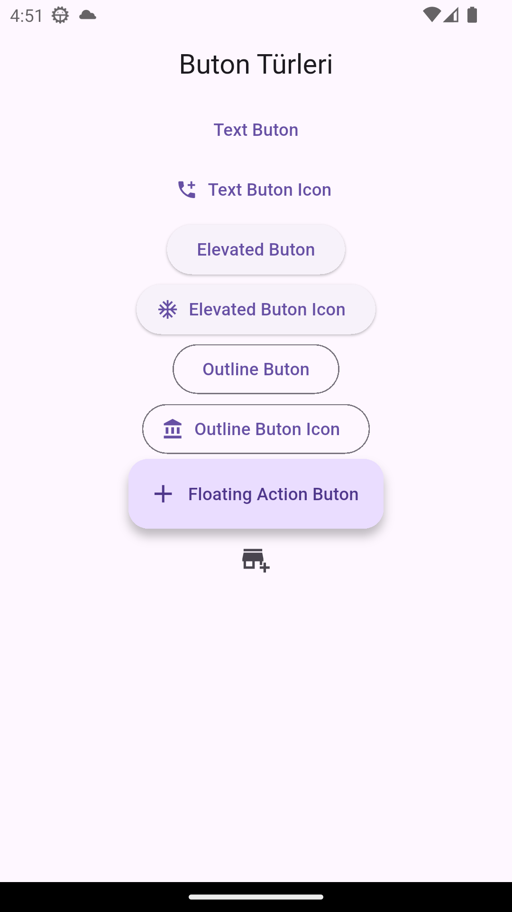

# Flutter Buton Örnekleri

Bu proje, Flutter'da kullanılan farklı buton türlerini basit örneklerle göstermektedir.  
Amaç, yeni başlayanların farklı stillerde buton kullanımlarını kolayca öğrenmesini sağlamaktır.

## Kullanılan Butonlar:
- ElevatedButton
- TextButton
- OutlinedButton
- IconButton
- FloatingActionButton

## 📸 Uygulama Görünümü

